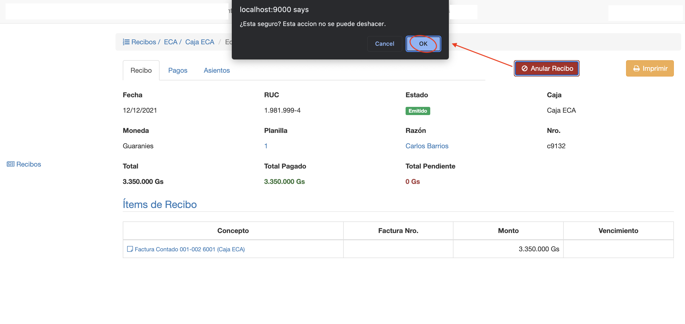
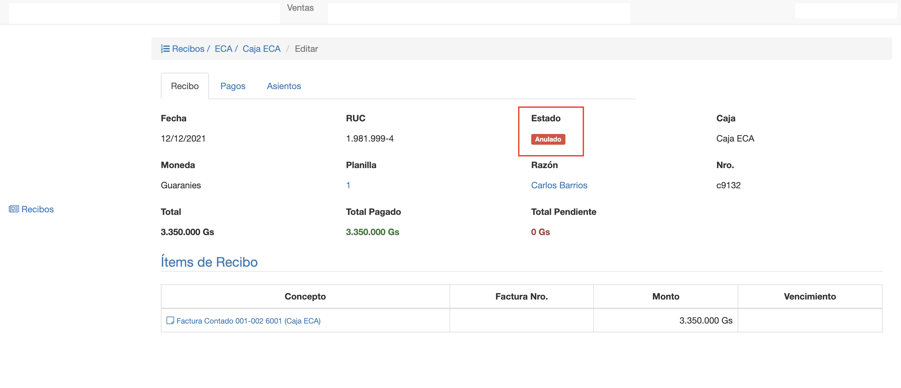

#Anular Recibo

Un recibo ya emitido, ya no se puede borrar. Debido a que ya se generó el asiento contable.
Entonces lo que se puede hacer es anular el recibo.
La anulación del recibo:
- Cambia el estado del recibo a Anulado.
- Restablece los saldos de las facturas.
- Crea un contraasiento para anular el asiento contable.

Para anular el recibo clic en el botón *Anular Recibo*, el sistema pide confirmación y luego de confirmar se ejecuta la
acción de anular recibo.
El sistema muestra el recibo en estado anulado y en la pestaña Asientos se puede acceder y verificar el 
contraasiento.

