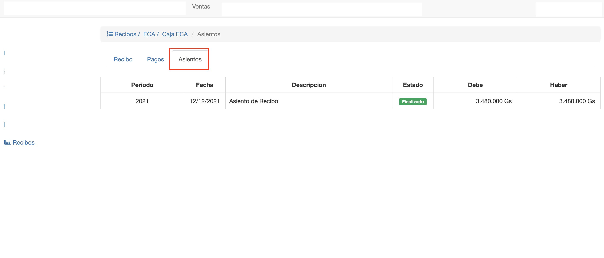

#Asientos

La emisión del recibo genera un asiento contable. El asiento
contable se genera en el periodo lectivo que corresponde a la fecha del recibo.
Los detalles del asiento se generan de la siguiente manera:

- Un detalle Debe por cada pago registrado, con el monto del pago y la cuenta configurada para el
medio de pago en la caja.
- Un detalle Haber para cada item, con el monto del item y la cuenta débito configurada para el
para el cliente de la factura. Para ver la cuenta configurada para el cliente, ir a Ventas/Clientes y buscar el cliente
de la factura pagada. Esta cuenta es la que se utiliza para el detalle.

Obs. Sólo los recibos de pago de factura a crédito generan asientos. Los pagos de factura contado
se se incluyen en los asientos de las facturas.

Para visualizar el asiento generado, clic en la pestaña Asientos, que aparece cuando
el recibo está en estado Emitido.

