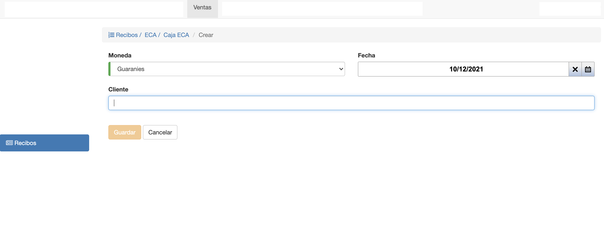

# Crear Recibo

Para crear un recibo, hacer clic en *Agregar Recibo* en la pantalla de listado. Se despliega la pantalla para crear el
recibo.

Los campos a completar son:

- **Moneda**: Define que se van a poder incluir Facturas emitidas con esta moneda.
- **Fecha**: Fecha de emisión del recibo.
- **Cliente**: Campo para buscar el cliente por nombre o número de documento.

Obs. El cliente debe ser el mismo que el de la razón social de la factura a crédito

Luego de completar los campos, clic en *Guardar* para crear el recibo. Se crea
un recibo en estado En Proceso y el sistema despliega la interfaz para editar recibo.

