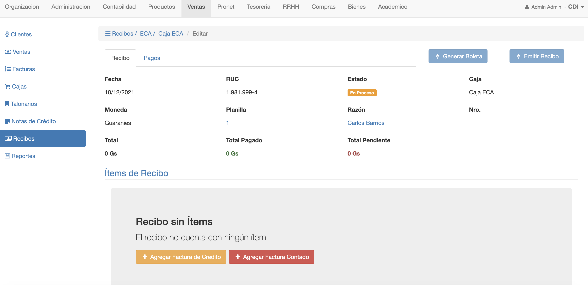
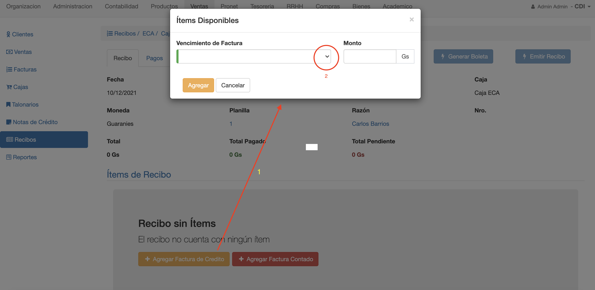
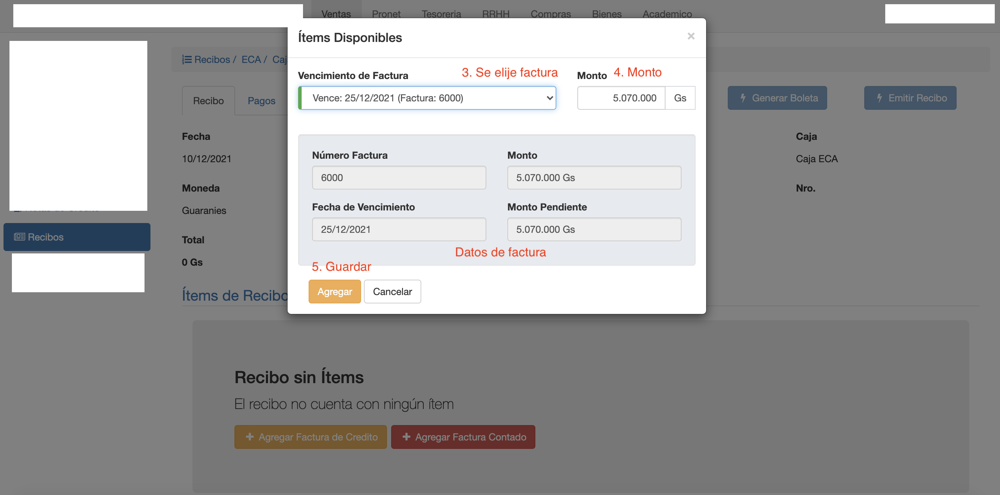
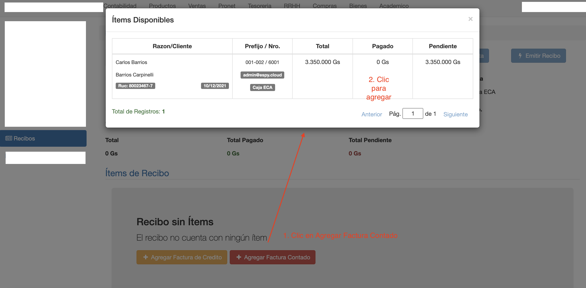
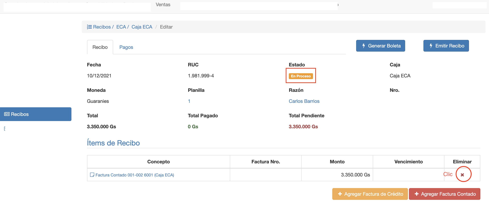

# Editar Recibo

La pantalla para editar recibo, se muestra luego de crear el recibo. También puede accederse a esta interfaz desde el
listado de recibos. Haciendo clic en el recibo que se quiere editar.

La pantalla para editar recibo ofrece las siguientes pestañas:

- **Recibo**: Para registrar los items del recibo.
- **Pagos**: Para registrar los pagos del recibo.

## Recibo

La pestaña Recibo permite:

- **Agregar Factura de Crédito**: Permite agregar factura a crédito, del cliente, que está pendientes de pago.
- **Listar los items ya agregados**: Cada item muestra un link a la factura que se agregó y el monto que se paga del item.
- **Agregar Factura Contado**: Permite agregar factura contado, del cliente, para registrar un pago.
- **Borrar Item de Recibo**: Permite borrar un item del recibo.

Las funcionalidades de Agregar y Borrado están habilitadas cuando el recibo está en estado *En Proceso*.

### Agregar Factura a Crédito

Para agregar una factura a crédito:

1. Clic en el botón *Agregar Factura de Crédito*. Se despliega una interfaz donde se
puede elegir qué factura a crédito agregar. 
2. Hacer clic en el campo Vencimiento de Factura. Para desplegar las facturas disponibles. Las facturas a crédito que se pueden agregar:
    - Deben ser del cliente asignado al recibo.
    - Deben estar en estado Parcial. Es decir, con deuda pendiente.
    - No deben estar en otros recibos en estado En Proceso.
3. Elegir la factura del listado. Se muestran sus datos como:
     - Numero de Factura
     - Monto
     - Fecha de Vencimiento.
     - Monto Pendiente
4. Modificar el campo Monto. Se puede pagar monto parcial si es necesario.
5. Clic en *Agregar*, para agregar la factura con el monto elegido.

Luego de agregar el item, se queda la interfaz abierta por si se requiere agregar otras facturas.

###Listado
Los items agregados al recibo se muestran en la grilla. Donde se muestran los siguientes datos de 
cada item:

- *Concepto*: Este campo muestra el tipo de detalle Factura a Crédito o Contado. Y es un link para navegar a la factura.
- *Factura Nro*: El Nro. de la factura que corresponde al item.
- *Monto*: El monto que se va a cobrar de la factura en el recibo.
- *Vencimiento*: La fecha de vencimiento de la factura a crédito.

La cabecera de esta pestaña muestra datos importantes a tener en cuenta como:

- *Estado*: El estado en que se encuentra el recibo. En Proceso, Emitido o Anulado.
- *Total*: El monto total que da la suma de los items agregados.
- *Total Pagado*: El monto total de los pagos que se registraron en el recibo. Ver pestaña Pagos.
- *Total Pendiente*: El monto pendiente por pagar del recibo.

###Agregar Factura Contado
También se pueden agregar facturas contado como items. Puede ser apropiado si se quiere hacer un sólo
para varias facturas contado. En vez de pagar factura por factura, hacer un recibo , incluir las facturas y registrar de una
sola vez el pago.

Para agregar una factura contado:

1. Clic en *Agregar Factura Contado*
2. Se muestra un listado de facturas contado disponibles. Clic en la factura elegida, para agregar al recibo.

Luego de agregar el item, se queda la interfaz abierta por si se requiere agregar otras facturas.
Las facturas agregadas se muestran en el listado, y se actualizan los totales de la cabecera.

**Obs.** Para poder utilizar la funcionalidad de Agregar Factura Contado, la caja debe tener configurada
el medio de pago Boleta. Ya que este medio de pago, se utiliza para cada factura contado que se paga con un recibo.
Para cada factura, se crea un pago de tipo Boleta, que está asociado al recibo de Pago.

###Borrar Items
Clic en la columna Eliminar, del item que se quiere borrar.
Esta columna está habilitada cuando el recibo está en el estado En Proceso.

Si se borra un item, puede volver a agregarse a este recibo o a otro recibo.

 