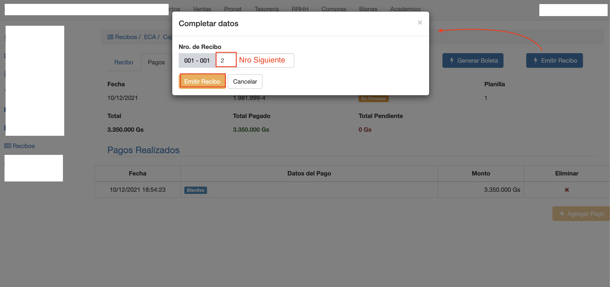
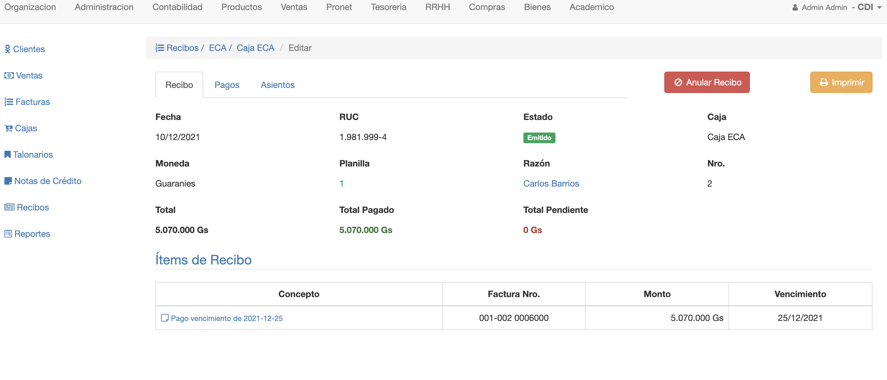
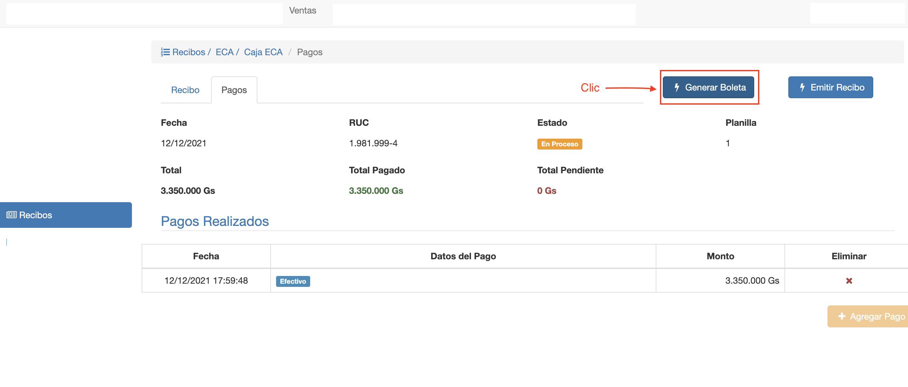
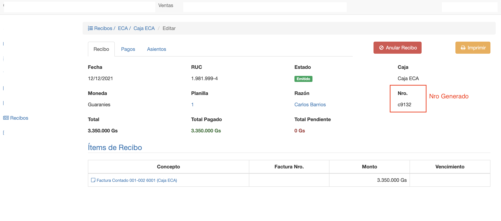

#Emitir Recibo

Al emitir un recibo, se realizan las siguientes transacciones:

- Pasar el recibo del estado En Proceso a Emitido.
- Se asigna el nro de comprobante o boleta al recibo.
- Se actualizan los saldos de las facturas relacionadas. Se aplican los pagos.
- Se genera un asiento contable con los detalles del recibo.

Se puede emitir un recibo si:

- El recibo tiene items agregados.
- El recibo tiene pagos agregados.
- El monto pendiente es 0, es decir, total = total pagado.

Hay dos maneras de emitir un recibo:

- Emitir Recibo, con comprobante legal.
- Generar Boleta.

##Emitir

El botón Emitir Recibo, permite asignar un nro de comprobante
del talonario al recibo y emitir el recibo.
Al pulsar el botón se despliega la interfaz para emitir el recibo, donde el sistema
autocompleta con el Nro. siguiente que corresponde al talonario.

*Obs*. El nro de comprobante puede modificarse para utilizar otro Nro, siempre que corresponda al talonario y 
no haya sido utilizado todavía.

Una vez elegido el Nro de comprobante. Pulsar Emitir Recibo. Se emite el recibo y se muestra
la pantalla actualizada del recibo.

##Generar Boleta
El botón Generar Boleta, permite emitir el recibo sin utilizar el talonario. Se emite como una
boleta o comprobante de pago, sin validez legal.
Puede utilizarse, por ejemplo, para pagar facturas contado.

Para Emitir un recibo como Boleta, clic en el botón Generar Boleta. Se emite el recibo, se *genera* un 
número de boleta para el recibo y se muestra la pantalla actualizada del recibo.

