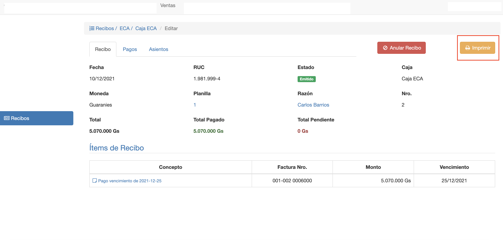
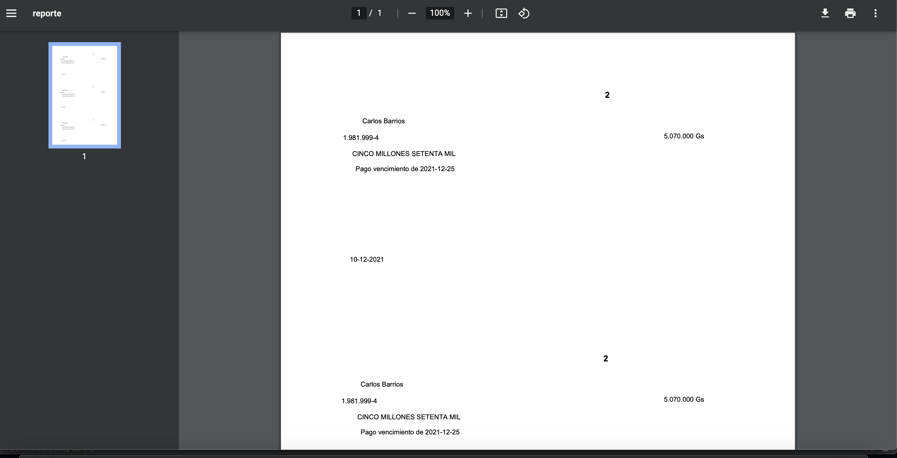
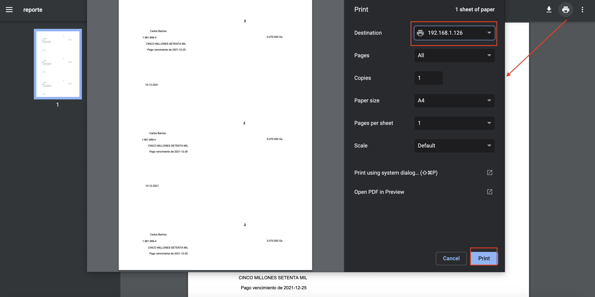

# Imprimir recibo

Luego de emitir el recibo, se habilita un botón para imprimir recibo sobre el papel preimpreso que corresponde al
talonario.

Al pulsar el botón Imprimir el sistema exporta el recibo a un archivo en formato PDF. Este archivo PDF, puede abrirse
con el navegador

Se puede notar que el .pdf sólo muestra los datos, ya que debe adecuarse al papel pre-impreso. Se puede imprimir de la
siguiente manera:

- Clic en el ícono de imprimir del PDF.
- Elegir la impresora destino.
- Pulsar Imprimir.

Obs. El papel debe estar configurado de acuerdo a la medida del papel pre-impreso. Por ej. Papel Oficio.

