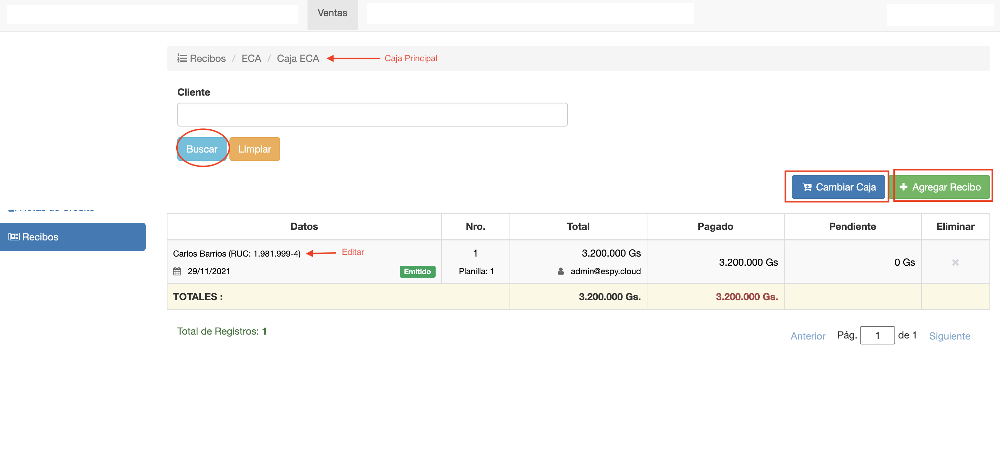
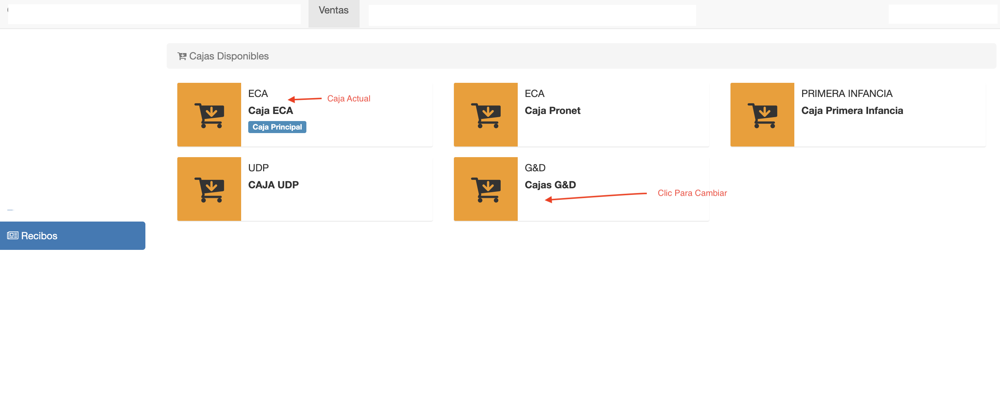

#Recibos

@@toc { depth=1 }
@@@ index
* [Crear Recibo](crear_recibo.md)
* [Editar Recibo](editar_recibo.md)
* [Pagos de Recibo](pagos_de_recibo.md)
* [Emitir Recibo](emitir_recibo.md)
* [Imprimir Recibo](imprimir_recibo.md)
* [Asientos](asientos.md)
* [Anular](anular_recibo.md)
@@@

Los recibos de venta se utilizan para emitir comprobante de cobro a un cliente.
En un recibo se deben incluir los items, que son los detalle de lo que se cobra.
Los items pueden ser: 

- Facturas a Crédito.
- Factura Contado.

También se debe registrar cada pago que se cobra, con su medio de pago y monto.

Para acceder, clic en el módulo *Ventas* y luego ir a la opción *Recibos* del menú de la
izquierda. Se despliega el listado de recibos de la caja que se está usando, la caja principal.

##Listado de Recibos
La interfaz de listado ofrece:

- Listado y Búsqueda de recibos de la caja en uso.
- Cambiar Caja. Permite elegir otra caja y mostrar los recibos.
- Agregar Recibo. Permite crear un recibo en la caja.
- Borrar Recibo. Permite borrar un recibo.

##Busqueda de Recibos
El listado muestra los recibos registrados para la caja en uso.
Se puede realizar una búsqueda por nombre de cliente o documento, y el listado muestra
los resultados.
Cada recibo, corresponde a una planilla de caja. La planilla se muestra como una columna del recibo.

##Cambiar Caja
Para listar recibos de otra caja, hacer clic en el botón Cambiar Caja.
Se despliega el listado de cajas, donde se muestra la actual Caja Principal. Clic sobre
la caja que se quiere marcar como Caja Principal y el sistema vuelve al listado de Recibos, mostrando
los recibos de la caja elegida.

##Borrar Recibo
Para borrar un recibo, pulsar el botón de la columna Eliminar del recibo que se quiere borrar.
Este botón se habilita cuando el recibo está en estado En Proceso. 

No se puede borrar un recibo que ya fue emitido. Sólo se puede anular.
