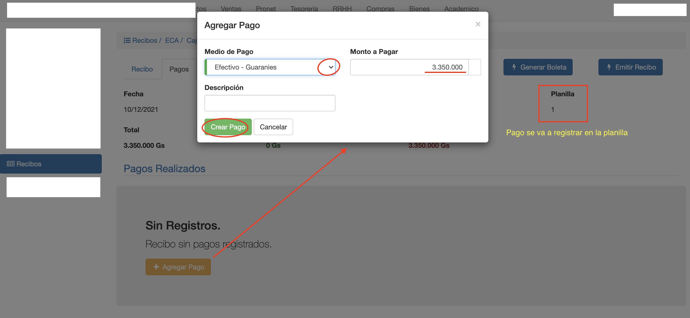

#Pagos de Recibo
En la pestaña Pagos, se pueden registrar los pagos que se recibieron 
como cobro por el monto total de los items agregados al recibo.

La pestaña Pagos permite:

- Agregar pagos.
- Listar pagos cobrados en recibo.
- Borrar pagos.

##Agregar Pagos
En un recibo se pueden agregar varios pagos, con los medios de pago
configurados para la caja del recibo.
Cada pago agregado, se adjunta a la planilla de caja del recibo. De tal manera a que los
pagos figuren en el arqueo de caja de la planilla.

Para agregar un pago:

1. Clic en Agregar Pago y se despliega la interfaz para elegir el medio de Pago.
2. Elegir el medio de Pago y completar los datos, de acuerdo al medio de Pago.
3. Completar el Monto a Pagar. Monto pagado con el medio de pago.
4. Clic en Crear Pago para agregar el pago al recibo.

Obs. Un pago se puede agregar cuando el recibo está en estado En Proceso.

##Listado de Pagos
Luego de agregar un pago:

1. Se actualiza la grilla con los pagos del recibo.
2. Se actualizan los totales:
  - Total Pagada: Muestra la suma de todos los pagos.
  - Total Pendiente: Muestra el monto pendiente por pagar.

Cada pago se muestra en la grilla con sus datos, por ej; monto, medio de pago, moneda etc.

Cuando ya se pagó el monto total, el Total Pendiente queda igual a 0. Entonces se puede
Emitir el Recibo.

##Borrar Pagos
Para borrar un pago, clic en la columna Eliminar del Pago.
Al borrar un pago, se actualizan los totales:

 - Se resta el monto del Total Pagado.
 - Se suma el monto al Total Pendiente.

Al borrar un pago, se borra también el pago de la planilla de caja.
Obs. Un pago se puede borrar cuando el recibo está en estado En Proceso.
