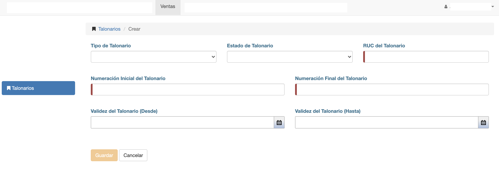

##Crear Talonario

Para crear un talonario, clic en el botón *Agregar Talonario* de la interfaz de listado.

El sistema despliega una interfaz con los datos necesarios para crear el talonario:

Los datos a completar son:

- **Tipo de Talonario**: Puede ser Factura, Recibo, Nota de Crédito o Autofactura.
- **Estado del Talonario**: Elegir estado Activo para crear y utilizar.
- **RUC del Talonario**: Se completa el Ruc de la Empresa o Titular del talonario.
- **Numeración Inicial del Talonario**: Número de la primera boleta del talonario.
- **Numeración Final del Talonario**: Número de la última boleta del talonario.
- **Validez del Talonario (Desde)**: Fecha desde la cual es válido el talonario.
- **Validez del Talonario (Hasta)**: Fecha hasta la cual es válido el talonario.
- **Número de Timbrado**: Número de timbrado correspondiente al talonario.
- **Código de Establecimiento**: Primeros tres dígitos del prefijo del talonario. **001**-002
- **Código de Punto de Expedición**: Últimos tres dígitos del prefijo del talonario. 001-**002**

Luego de completar, clic en botón *Guardar*.  Se crea el talonario y se crean sus documentos correspondientes. Un documento
por cada numero de boleta incluido entre el Número Inicial y Número Final del talonario.

Los documentos son los que se asocian y numeran a las facturas, notas de crédito etc.

