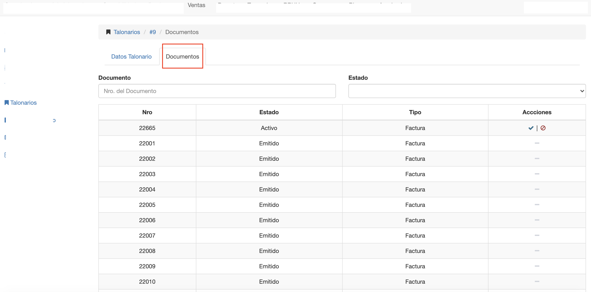

#Documentos de Talonario
La pestaña documentos de un talonario muestra los
documentos o números generados para el talonario. De acuerdo al Número Inicial y Número Final
definido en el talonario.

Esta interfaz ofrece:

- Grilla donde se listan todos los documentos. Detallando el nro y estado de cada documento y si es el documento es actual.
- Acción para anular un documento.
- Filtros para buscar documentos por nro y estado de documento.

El documento marcado como Actual, es el documento cuyo número se va a utilizar en la siguiente
emisión de un comprobante.
Los estados en que puede estar un documento son:

- **Activo**: Nro disponible para su uso como comprobante.
- **Anulado**: Nro anulado, fue utilizado como comrprobante pero anulado posteriormente.
- **Emitido**: Nro utilizado y emitido como comprobante.