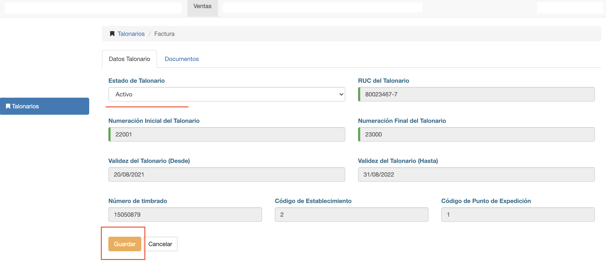

#Editar Talonario

Luego de crear el talonario o al hacer clic en un talonario en el listado, se despliega
la interfaz para *Editar Talonario*.

Esta interfaz presenta dos pestañas:
 - Datos Talonario: para editar los datos del talonario.
 - Documentos: para listar y gestionar los documentos generados.

#Datos de Talonario
Los datos editables dependen del estado del talonario

###Talonario en estado Nuevo

Si el talonario está en estado Nuevo, se pueden editar todos los datos. Ya que aún el talonario
no está disponible para su uso en el sistema y todavía no tiene los documentos generados.
Entonces, si se cambia del estado Nuevo a Activo y se guarda. El sistema genera los números/documentos del
talonario. Y el talonario ya puede utilizarse en el sistema.

###Talonario en estado Activo o Vencido
Si el talonario está en otro estado, sólo se puede modificar el estado del talonario:

- Cambiar de Activo a Vencido.
- Cambiar de Vencido a Activo.

