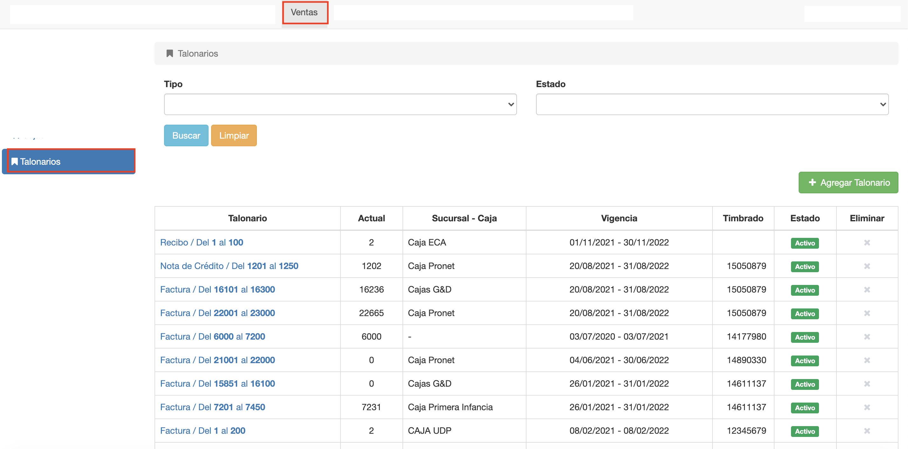

#Talonarios

@@toc { depth=1 }
@@@ index
* [Crear Talonario](crear_talonario.md)
* [Editar Talonario](editar_talonario.md)
* [Documentos de Talonario](documentos_de_talonario.md)
@@@

Esta funcionalidad permite mantener talonarios para las operaciones
del sistema que requieren comprobante.

Los tipos de talonarios que se pueden gestionar son:

- Talonarios para facturas de venta.
- Talonarios para de recibos de venta.
- Talonario para nota de crédito de venta.

***Luego de crear un talonario, debe asignarse a una caja para poder utilizarse
en facturas, recibos o notas de crédito.***

Para acceder a la funcionalidad de talonarios ir al módulo *Ventas* y luego
a la opción *Talonarios* del menú de la izquierda.

En esta pantalla se puede:

- Listar y filtrar talonarios.
- Agregar nuevo talonario.
- Editar talonario.
- Borrar talonario.

##Listar Talonarios
La pantalla principal muestra una grilla que lista los talonarios registrados.
Se ofrecen dos filtros de búsqueda:

- Tipo de Talonario.
- Estado de Talonario.

Que pueden completarse y luego pulsar el botón Buscar para realizar la busqueda
y mostrar los resultados en la grilla.

