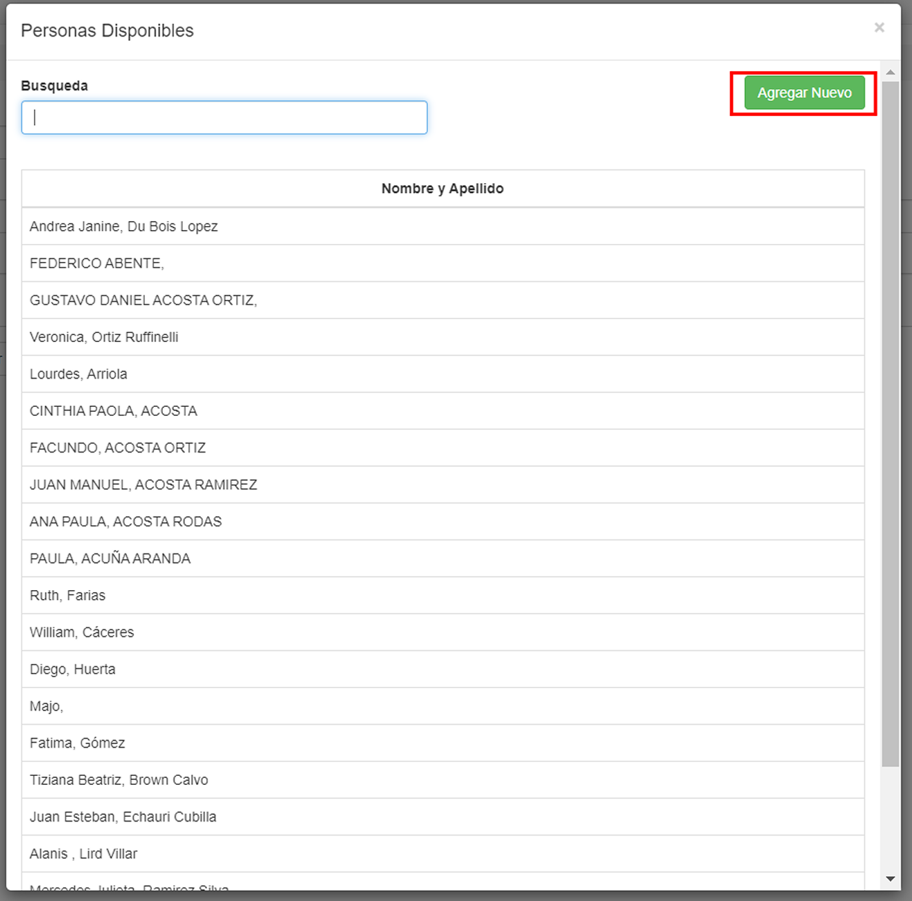
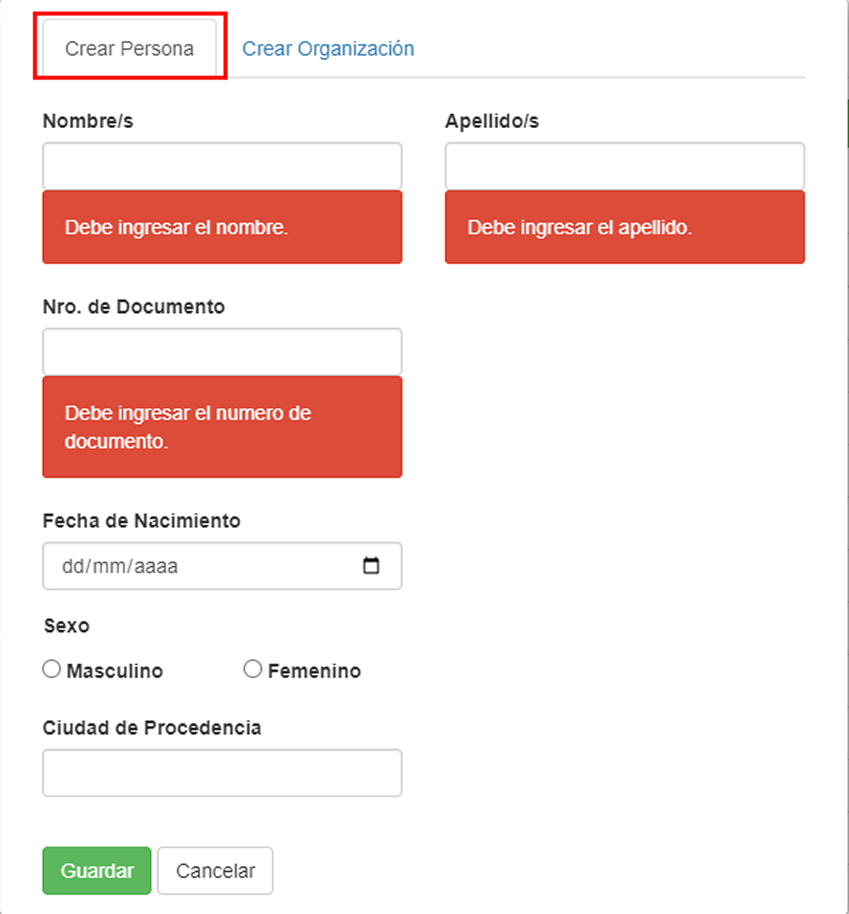

# Agregar nuevo cliente

Al presionar el botón __Añadir nuevo__, el usuario puede acceder a dos ventanas diferentes.

* __Crear persona:__ El usuario introduce los datos del nuevo cliente (Nombre, apellido, Nro. de Documento, fecha de nacimiento, sexo y ciudad de procedencia.)

* __Crear organización:__ 

