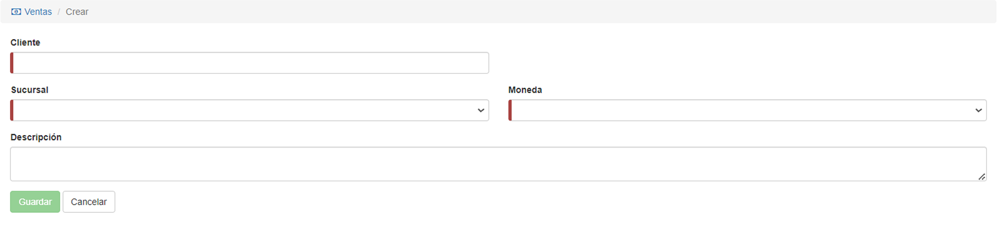
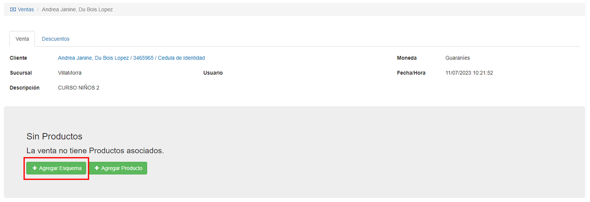

# Crear venta

Al presionar el botón __Agregar venta__ que se encuentra bajo los filtros, el usuario puede añadir un nuevo registro de venta al sistema.

* __Cliente:__ Para completar esta sección, el usuario debe seleccionar un cliente ya inscripto o __agregar un nuevo cliente__. La barra de búsqueda permite filtrar los resultados. 

* __Sucursal:__ Indica la sucursal que corresponde al producto.

* __Moneda:__ Indica la moneda con la se realizará el pago.

* __Descripción:__ Detalle del producto en venta. 

Una vez completados los datos, la venta se registra existosamente.

Al presionar el botón __agregar un esquema__, el usuario accede a una nueva pantalla que permite construir un esquema personalizado. 

