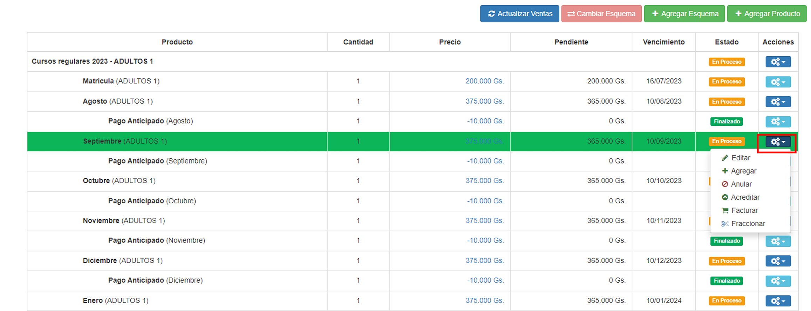

# Editar venta

Para editar una venta, el usuario debe seleccionar la fila correspondiente a la venta que desea editar. 

Una venta consiste en un __ítem padre__ e __ítems hijos__.

* El __ítem padre__ describe la venta total.

* Los __ítems hijos__ son los que indican las cuotas con sus vencimientos. Pueden tener varias funciones, para acceder a ellas el usuario debe ingresar al botón azul a la derecha, de la fila correspondiente a la venta. 

Al presionar el botón, se despliega una lista de funciones de los __ítems hijos__:

@@toc { depth=1 }
@@@ index

* [Editar](item_hijo_editar.md)
* [Agregar](item_hijo_agregar.md)
* [Anular](item_hijo_anular.md)
* [Acreditar](item_hijo_acreditar.md)
* [Facturar](item_hijo_facturar.md)
* [Fraccionar](item_hijo_fraccionar.md)

@@@
