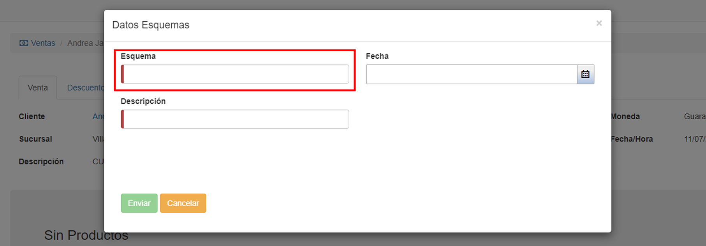
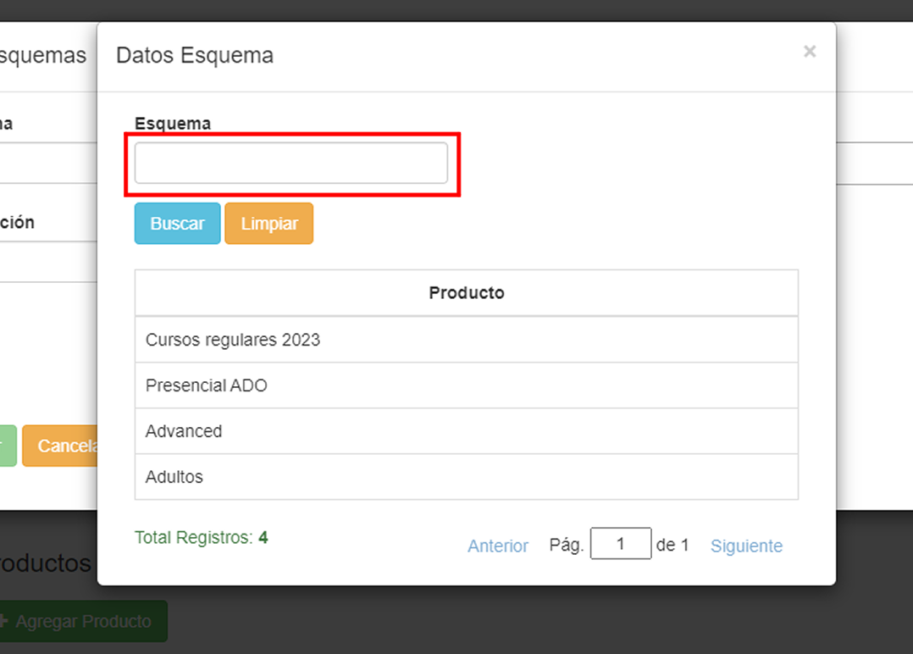
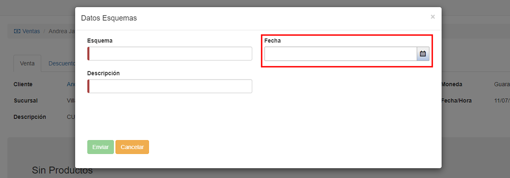
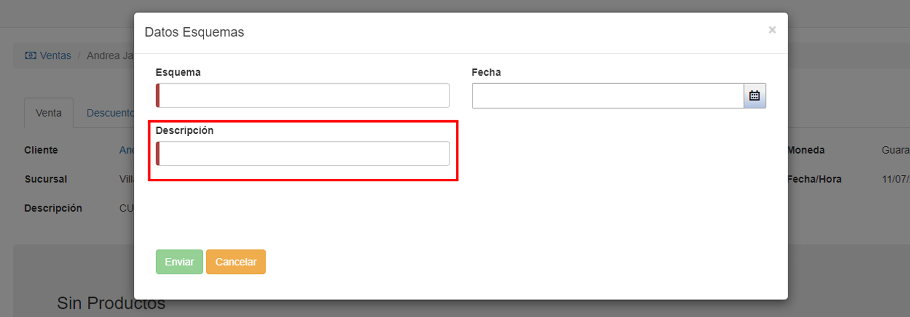

# Crear esquema
El esquema genera cuotas a partir de los datos del cliente y del producto. 

Para crear un nuevo __esquema__, el usuario debe completar las tres secciones indicadas:

* __Esquema:__ El usuario indica el producto.

* __Fecha:__ Indica la fecha desde la que se van a generar las cuotas. 

* __Descripción:__ Indica el detalle del producto por el que se generan las cuotas.

