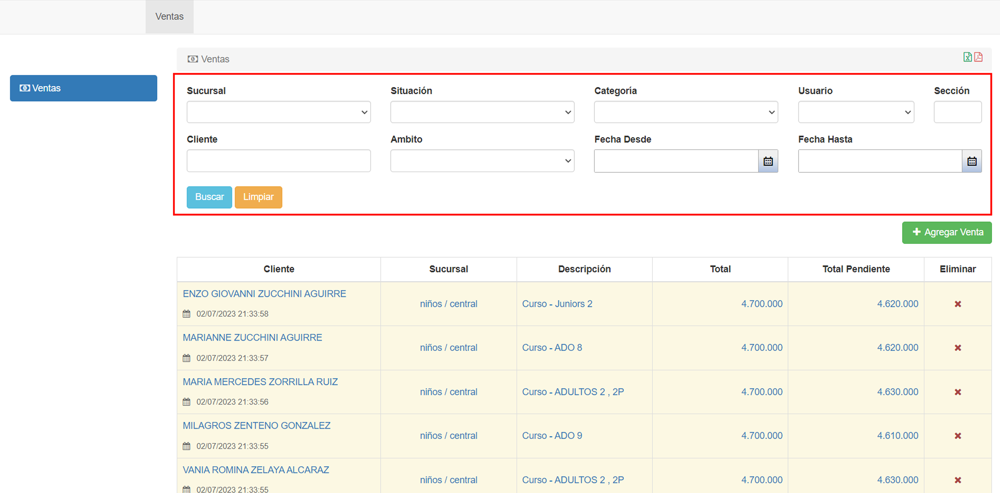
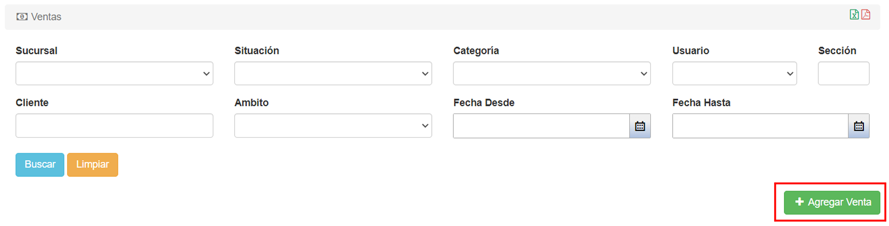

# Filtros de búsqueda

Se pueden filtrar las ventas según los siguientes __parámetros__:
* __Sucursal:__ Se indica la sucursal en la que el alumno estará estudiando.

* __Cliente:__ Nombre completo del __estudiante__.

* __Situación:__ Se indica si el cliente se encuentra __con deudas__, __sin deudas__ o __con deudas vencidas__.

* __Ámbito:__ Se indican los niveles de la inscripción.

* __Categoría:__ Categoría del producto que corresponde al curso.

* __Usuario:__ Se indica el usuario que ejecuta el sistema.

* __Fecha desde:__ Se indica la fecha desde la cual se realiza una búsqueda de venta.

* __Fecha hasta:__ Se indica la fecha hasta la cual se realiza una búsqueda de venta.

En la esquina inferior izquierda podemos encontrar los botones __Buscar__ y __Limpiar__. Al presionar el botón __Buscar__, se filtran los resultados, y al para borrar los filtros el usuario debe presionar el botón __Limpiar__.

Al presionar el botón __Agregar venta__ que se encuentra bajo los filtros, el usuario puede añadir un nuevo registro de venta al sistema.

