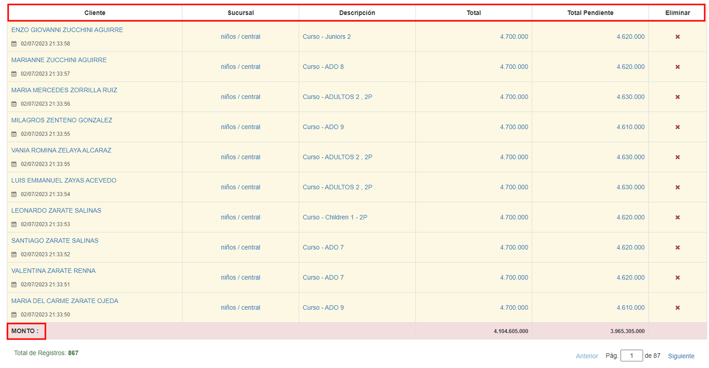

# Grilla de resultados

* __Cliente:__ En la columna "Cliente" se indica el nombre completo del __estudiante__, junto a la fecha y hora de la generación de la deuda.

* __Sucursal:__ Se indica la sucursal en la cual el alumno estudia y el nivel cursado. 

* __Descripción:__ Detalle de la deuda generada.

* __Total:__ En la columna "Total" se indica el monto total a pagar.  

* __Total pendiente:__ Se indica la deuda o el monto negativo del cliente.  

* __Eliminar:__ En la columna "Eliminar" el usuario puede descartar filas de la grilla. 

* __Monto:__ En el inferior de la grilla encontramos la fila "Monto" que indica el monto a pagar de todos los clientes y la deuda total de los clientes. 

