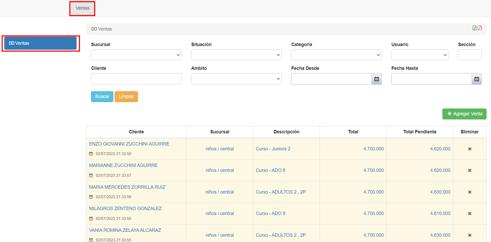

# Ventas

@@toc { depth=1 } 
@@@ index
* [Listado de ventas](listado_de_ventas.md)
@@@

## Introduccion

La interfaz de ventas permite gestionar las deudas o ventas registradas de los clientes.
Las deudas se generan a partir de la inscripción de cada alumno a los diferentes cursos.

## Acceso

Para acceder a esta funcionalidad, se ingresa a al módulo ventas y luego a las pestaña de ventas.

