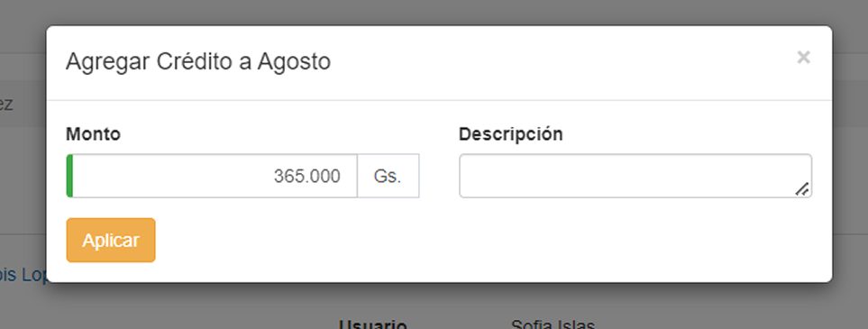

# Acción para ítem hijo: Acreditar

Al presionar el botón de __Acreditar__, el sistema dirige al usuario a una nueva pantalla que permite agregar crédito al producto. 

Al completar las secciones __Monto__ (Crédito a agregar) y __Descripción__ (Detalle), el usuario puede aplicar la acreditación presionando el botón __Aplicar__.