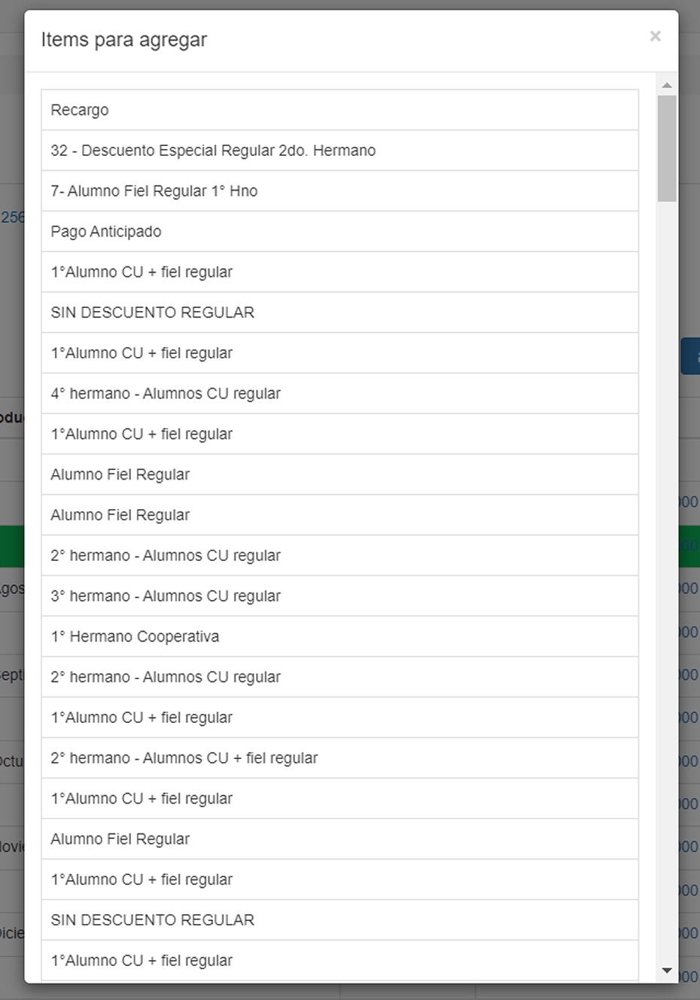
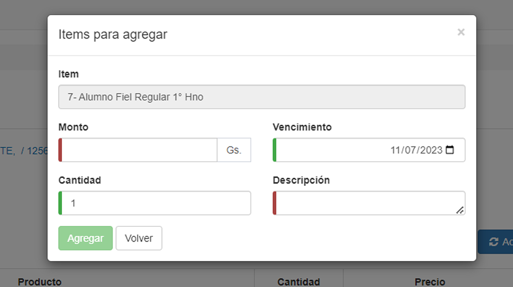

# Acción para ítem hijo: Agregar

Para agregar un ítem, el usuario simplemente debe presionar sobre el botón __Agregar__. El sistema despliega una lista de posibles ítems para agregar. 

Al seleccionar un ítem en específico, el sistema presenta la siguiente pantalla:

El usuario debe rellenar con los datos requeridos __(Monto del ítem, cantidad de ítems, vencimiento de la cuota y descripción del ítem)__ para agregar un nuevo ítem. 