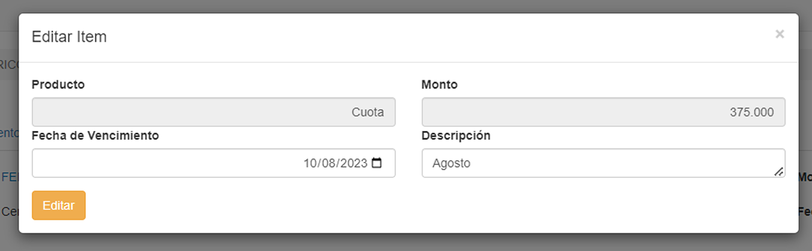

# Acción para ítem hijo: Editar

Al presionar el botón de __Editar__, el usuario ingresa a una pantalla que le permite realizar cambios en la venta.

* __Producto:__ Indica el nuevo producto.

* __Fecha de vencimiento:__ El usuario indica la nueva fecha de vencimiento.

* __Monto:__ El usuario indica el nuevo monto de la cuota.

* __Descripción:__ El usuario ingresa un nuevo detalle que describe al nuevo producto. 