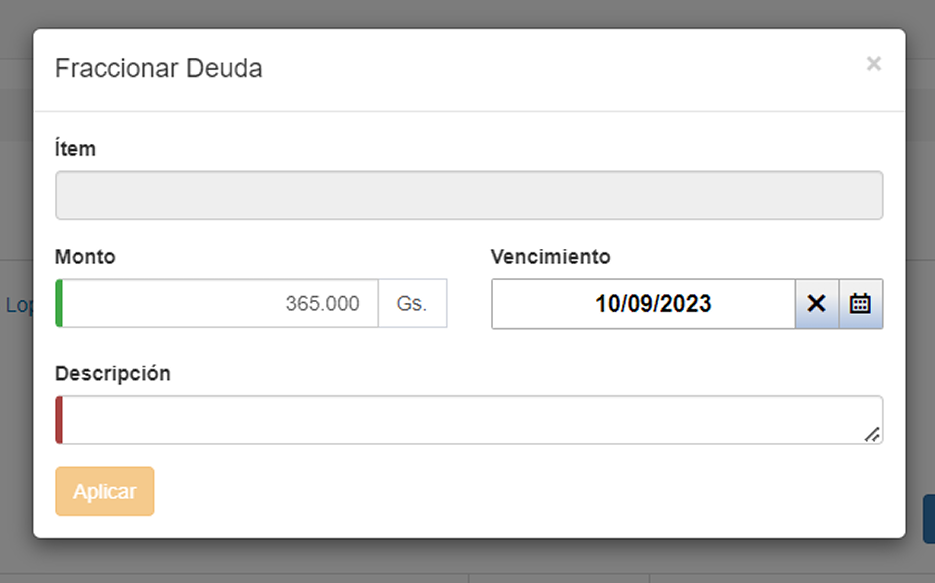

# Acción para ítem hijo: Fraccionar

Para fraccionar una deuda, el usuario debe presionar el botón de fraccionar para acceder a la siguiente pantalla:

El usuario debe completar las secciones:

* __Ítem:__ Indica el producto.

* __Monto:__ Indica la fracción del monto total. 

* __Vencimiento:__ Indica la fecha de vencimiento de la cuota.

* __Descripción:__ Detalle del producto.
